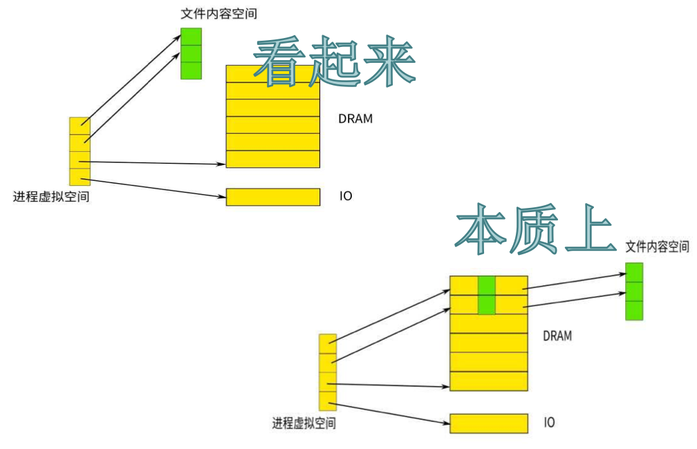
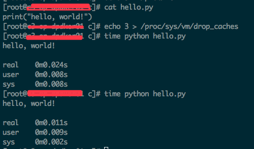

# Linux内存管理 - 内存与I/O的交换

## 摘要
* page cache
* free命令的详细解释
* read、write和mmap
* file-backed的页面和匿名页
* swap以及zRAM
* 页面回收和LRU

###  思考
&emsp;&emsp;&emsp; Linux总是以Lazy的方式给应用程序分配内存。包括堆、栈(函数调用越深,用的栈越多,最终发生page fault才得到栈)、代码段、数据段。那么,这些已经得到内存的段一直占用着内存吗? 

### 名词解释
* swap

&emsp;&emsp;&emsp; swap在Linux可以翻译成两个意思。动词，内存交换。内存和磁盘的颠簸行为;名词,linux有一个硬盘分区,被做成swap分区。当不使用swap分区的时候,linux内存也在进行swap,因为有文件背景的页面也在进行swapping。

* buf
&emsp;&emsp;&emsp; 一个程序读取文件时,会先申请一块儿内存数组,称为buffer。然后每次调用read,读取设定字节长度的数据,写入buffer。之后的程序都是从buffer中获取数据,当buffer使用完后,再进行下一次调用,填充buffer。

## Page cache
&emsp;&emsp;&emsp; 在linux读写文件时,它用于缓存文件的逻辑内容,从而加快对磁盘上映像和数据的访问(下次再读文件时,如果page cache有数据,则直接从内存中获取数据)。

* 

### Linux读写文件方式
&emsp;&emsp;&emsp;linux下读写文件,主要有两种方式:

&emsp;&emsp;&emsp; * read/write
 
&emsp;&emsp;&emsp;&emsp;&emsp;&emsp; 调用read读文件,Linux内核会申请一个page cache,然后把硬盘文件读到page cache中。再将内核空间的page  cache数据拷贝到用户态的buf中。
 
&emsp;&emsp;&emsp;&emsp;&emsp;&emsp; 调用write写文件,则将用户空间buf拷贝到内核空间page cache(可通过sync 将内存数据刷到磁盘)。

&emsp;&emsp;&emsp; * mmap
 
&emsp;&emsp;&emsp;&emsp;&emsp;&emsp; 操作文件为了避免用户空间到内核空间拷贝,mmap直接把文件映射成一个虚拟地址指针,这个指针指向内核申请的page cache。内核知道page cache与文件的对应关系。只要直接对这个指针操作,就直接操作了这个文件。

* 

&emsp;&emsp;&emsp; 编译和运行结果:

* 

&emsp;&emsp;&emsp; mmap看起来是由一个虚拟地址对应一个文件(可以直接用指针访问文件),本质上是把进程的虚拟地址空间映射到DRAM(内核从这片区域申请内存做page cache),而这个page cache对应磁盘的某个文件,且linux 内核会维护page cache和磁盘中文件的交换关系。

* 

&emsp;&emsp;&emsp; Page cache可以看作磁盘的一个缓存,应用程序在写文件时,其实只是将内容写入了page cache,然后使用sync才能真的写入文件。
&emsp;&emsp;&emsp; Page cache可以极大的提高系统整体性能。如,进程A读一个文件,内核空间会申请pache cache与此文件对应,并记录对应关系。进程B再次读同样的文件就会直接命中上一次的page cache,读写速度显著提升。但Page cache会根据LRU(最近最少使用)算法进行替换。

### Page cache对应用程序的影响
&emsp;&emsp;&emsp; Pache cache到底对程序是否真的有性能提升,需要试验进行验证。如下是一个验证Page cache对程序影响的例子。

* 

&emsp;&emsp;&emsp; 通过如上的执行结果可以看出,相同的程序执行。第二次执行之间比第一次提升1倍多。什么原因导致的呐？

* 

&emsp;&emsp;&emsp; 通过再次对两次执行结果详细

比较,发现第一次执行时Major page fault(从磁盘swap)共发生14次,第二次Major page fault 0次;第一次 File system inputs 共发生5648次,第二次File system inputs发生0次。通过这样的比较,相同程度的两次执行时间差消耗在了磁盘IO上。所以Page Cache对程序的影响还是挺大的。

注意:
 
&emsp;&emsp;&emsp; cache可以通过/proc/sys/vm/drop_caches强行释放。1 释放 page cache, 2释放dentries和inode, 3 释放两者。

## 待续...

