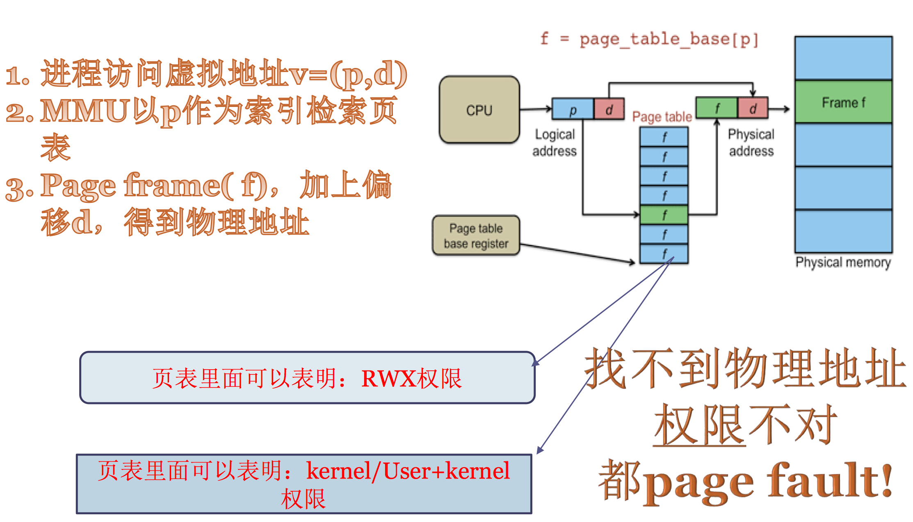
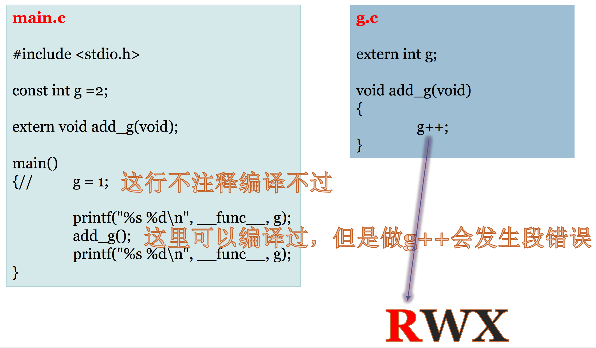
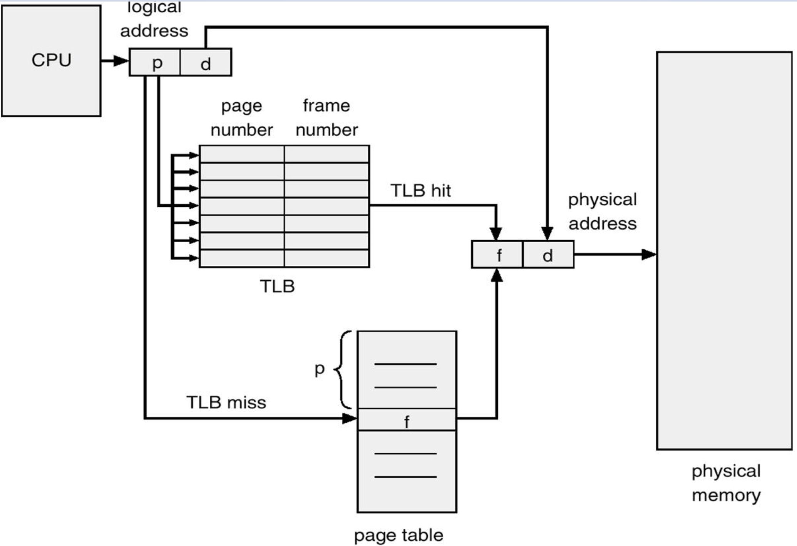
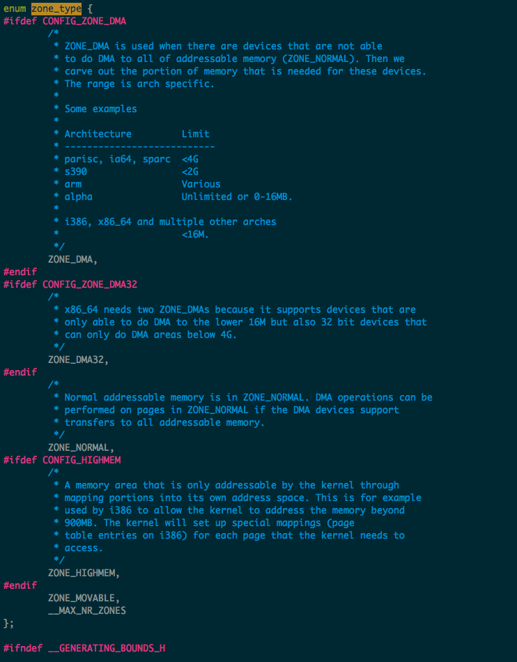

# Linux 内存管理

## 摘要
* MMU与分页机制
* 内存Zone
* Linux Buddy分配算法
* DMA和CMA(连续内存分配器)


## MMU与分页机制

### MMU
**MMU**(内存管理单元),是一个硬件。辅助操作系统进行内存管理,提供虚拟地址和物理地址的映射、内存访问权限保护和Cache缓存控制等硬件支持。CPU一旦开启MMU,CPU就只能看到虚拟地址(程序员也只能看到虚拟地址),只有MMU能看到物理地址。

#### MMU功能

* 提供虚拟地址和物理地址的映射</br>
<br>
&emsp;&emsp;例如,CPU访问一个32位的虚拟地址0x12345670,假设MMU的管理把每一页的内存分成4KB(在32位操作系统通常采用的Page Size位4K),上图中p(页号)即为12345,d(页内偏移地址)即为670。首先用p去查页表(页表本身也在内存),找到对应的页表项(PTE),PTE里面填写了这一页虚拟地址所对应的物理地址。
<br>

<br>

* 内存访问权限保护
<br>
每个PTE中除了有虚拟地址和物理地址对应关系外,还有当前页的RWX权限。比如,代码段中只有R+X权限。如果食用一个指针去写代码段,就会发生"Page fault。"

<br>
<font color=#F08080	 size=3>&emsp;&emsp;&emsp;注:
<br>
&emsp;&emsp;&emsp; 1. 基址寄存器存页表的基地址,每次进程切换时,寄存器的值都会改变,因为每一个进程的页表都不一样。
<br>
&emsp;&emsp;&emsp; 2. 两种情况都会导致"Page fault"。第一种:虚拟地址没有找到对应的物理地址;第二种: 虚拟地址有对应的物理地址,但权限不对。
</font>

<br>

<br>

&emsp;&emsp;&emsp; 另外一个重要的地方是,在MMU的页表中还可以标注这一页的另一个并行的权限。即这个虚拟地址可以在用户态与内核态访问,还是只能在内核态访问。
<br>
&emsp;&emsp;&emsp; IA32下,内核空间地址一般映射到3G~4G(VM),在PTE中就把3G以上的页表设置为只有当CPU陷入到内核模式才能访问。这样就限制了用户态程序对内核数据的访问。
&emsp;&emsp;&emsp; 前段时间Intel Meldown漏洞就属于旁路攻击,突破硬件限制。


#### 虚拟地址Vs.物理地址
&emsp;&emsp;&emsp; "虚拟地址"是个指针,"物理地址"是个整数(32位或者64位整数,不是指针),可参考内核代码对物理地址定义(include/linux/types.h):

<br>

<br>


#### TLB(Translation Looksize Buffer)
&emsp;&emsp;&emsp; 由于页表访问速度很慢(Page table位于内存中)。引出MMU的核心部件TLB(硬件级页表缓存部件,cpu内部硬件),TLB是MMU核心部件,它缓存少量的虚拟地址和物理地址的转换关系,是转换表的Cache,俗称"快表"。
<br>
&emsp;&emsp;&emsp; 当TLB中没有缓冲对应的地址转换关系时,需要通过对页表(大多数处理器的页表为多级页表)的访问来获得虚拟地址和物理地址的对应关系,引出MMU的另一个部件TTW(Translation Table walk)。TTW成功后,结果应写入TLB中。

<br>

<br>


<font color=#F08080	 size=3>&emsp;&emsp;&emsp;注:
<br>
&emsp;&emsp;&emsp; 每个进程都有单独的page table,当进程发生切换时通过修改寄存器值,当前进程虚拟地址和page table进行关联。
</font>

#### MPU(Memory protection unit)
&emsp;&emsp;&emsp; 内存保护单元,它和MMU相比。没有虚拟地址和物理地址映射,只能对内存做权限管理(实模式)。
<br><br>

## 内存模型
----------------------------

### 共享存储型多处理器有两种模型
* 均衡存储器存储(Uniform-Memory-Access，简称UMA)模型
* 非均匀存储器存取（Nonuniform-Memory-Access，简称NUMA）模型


#### UMA模型
&emsp;&emsp;&emsp; 物理存储器被所有处理机均匀共享。所有处理机对所有存储字具有相同的存取时间，这就是为什么称它为均匀存储器存取的原因。每台处理机可以有私用高速缓存,外围设备也以一定形式共享。

#### NUMA模型
&emsp;&emsp;&emsp; NUMA模式下，处理器被划分成多个”节点”（node）， 每个节点被分配有的本地存储器空间。 所有节点中的处理器都可以访问全部的系统物理存储器，但是访问本节点内的存储器所需要的时间，比访问某些远程节点内的存储器所花的时间要少得多。

<br><br>
## 存储节点(None)
<br>

<font color=#1c1c1c size=4> TODO </font>
<br><br>

## 内存管理区(Zone)
&emsp;&emsp;&emsp; Linux系统把物理内存划分为三个层次来管理。

#### 物理内存层次

* 存储节点(Node): CPU被划分为多个节点(node), 内存则被分簇,每个CPU对一个本地物理内存,即一个CPU-node对应一个内存簇bank,即每个内存簇呗认为一个节点。

* 管理区(Zone): 每个物理内存节点node被划分为多个内存管理区域,用于表示不同范围的内存,内核可以使用不同的映射方式映射物理内存。

* 页面(Page): 内存被细分为的多个页面帧,页面是最基本的页面分配单位。

#### 为什么要将内存node分成不同的区域zone
&emsp;&emsp;&emsp; NUMA结构下, 每个处理器CPU与一个本地内存直接相连, 而不同处理器之前则通过总线进行进一步的连接, 因此相对于任何一个CPU访问本地内存的速度比访问远程内存的速度要快, 而Linux为了兼容NUMA结构, 把物理内存相依照CPU的不同node分成簇, 一个CPU-node对应一个本地内存pgdata_t。
&emsp;&emsp;&emsp;  这样已经很好的表示物理内存了, 在一个理想的计算机系统中, 一个页框就是一个内存的分配单元, 可用于任何事情:存放内核数据, 用户数据和缓冲磁盘数据等等. 任何种类的数据页都可以存放在任页框中, 没有任何限制。

##### 但是Linux内核又把各个物理内存节点分成个不同的管理区域zone, 这是为什么呢?
&emsp;&emsp;&emsp; 因为实际的计算机体系结构有硬件的诸多限制, 这限制了页框可以使用的方式。尤其是, Linux内核必须处理80x86体系结构的两种硬件约束。

* ISA总线的直接内存存储DMA处理器有一个严格的限制 : 他们只能对RAM的前16MB进行寻址
* 在具有大容量RAM的现代32位计算机中, CPU不能直接访问所有的物理地址, 因为线性地址空间太小, 内核不可能直接映射所有物理内存到线性地址空间, 我们会在后面典型架构(x86)上内存区域划分详细讲解x86_32上的内存区域划分。

<font color=#F08080	 size=3>&emsp;&emsp;&emsp;注:
<br>
&emsp;&emsp;&emsp; 因此Linux内核对不同区域的内存需要采用不同的管理方式和映射方式, 因此内核将物理地址或者成用zone_t表示的不同地址区域。
</font>


### 内存管理区类型Zone_type
&emsp;&emsp;&emsp; 由于硬件的一些约束,低端的一些地址被用于DMA,当实际内存大小超过了内核所能使用的线性地址的时候,一些高处地址处的物理地址不能简单持久的直接映射到内核空间。因此,内核将内存的节点node分成了不同的内存区域方便管理和映射。

<br>

<br>
<br>

<br>

&emsp;&emsp;&emsp; 不同的管理区的用途是不一样的,ZONE_DMA类型的内存区域在物理内存的低端,主要是ISA设备只能用低端的地址做DMA操作。ZONE_NORMAL类型的内存区域直接被内核映射到线性地址空间上面的区域(line address space), ZONE_HIGHMEM将保留给系统使用,是系统中预留的可用内存空间,不能被内核直接映射。
 
<br>
# 以下内容待整理.....

    
* CPU开启MMU之后,CPU访问的就是虚拟地址,如果需要访问物理地址需要通过MMU地址映射进行访问(只有MMU可以看到物理地址).

* 例子:
    假设访问虚拟地址0x12345670,Page table页内虚拟地址0x12345000(页号)对应的物理内存为1M.那么0x12345670对应的物理地址为1M＋0x670(页偏移).

* cpu 首先查看TLB看是否有虚拟地址0x12345000和物理地址的映射关系,如果Hit,则MMU直接访问1M+0x670物理内存地址;如果TLB Miss,则查看Page table,MMU再去访问1M+0x670物理内存,同时将内存映射关系缓存在TLB一份。

* 备注:
    1. Page table位于内存中,TLB位于在cpu内部(硬件级页表缓存部件)。
    2. 每个进程都有单独的page table,当进程发生切换时通过更改寄存器值,进程虚拟地址和新的page table关联。
    3. 虚拟地址是一个指针,物理地址是一个整数。


### 虚拟存储器保护工具
    现在计算机系统必须为操作系统提供手段来控制对存储器系统的访问。不应该允许一个用户进程修改它的只读文本段,而且也不应该允许它读或者修改任何内核中的代码和数据结构。不应该允许它读或者写其它进程的私有存储器,并且不允许它修改任何与其它进程共享的虚拟页面,除非所有的共享者都显示地允许它这么做.

    每次CPU生成一个地址时,地址翻译硬件都会读一个PTE(也表条目),所以通过在PTE上添加一些额外的许可位来控制对一个虚拟页面内容的访问.每个PTE增加了三个许可位。SUP位表示进程是否必须运行在内核(超级用户)模式下才能访问该页。运行在内核模式中的进程可以访问任何页面,但是运行在用户模式中的进程只允许访问那些SUP 为0的页面READ位、WRITE位控制对页面的读和写访问.如果一条指令违反了这些许可条件,那么CPU就触发一个一般保护故障,将控制传递给一个内核中的异常处理程序.Unix外壳一般将这种异常报告为"段/页错误"(segmentation/page fault)。

* PTE(页表项)除了RWX权限之外,还有一个访问权限:
    1. 当前页表项,内核态可以访问。
    2. 当前页表项,用户态可以访问。
    3. 当前页表项,只能在内核态访问。

`MMU硬件比较牛逼的地方就是,可以指定PTE仅可以被内核态进行访问。这样所有的用户态进程都无法读取到内核态内容。前一段Intel 出现的Meltdown漏洞,就是用户态进程可以读取到内核态内容。`

```
a[256];                     // 每个成员4096,每个成员4096,保证每个成员间尽可能隔的远些。保证不会被读进cache.
c = *k->内存管理会拦截k     // k是内核地址,假设内存是c
a[c]                        // 这里导致cache命中

for(...)
    a[i]                    // a[0] ~ a[255] 哪个读地最快,就证明k地址存的是哪个:
```

* 备注:
    1. 有CPU没有MMU硬件,但会有MPU硬件.它主要用做内存保护,不能做虚实映射.更详细的MPU这里不再深入阐述,感兴趣同学可以进行Wikipad.
    2. page fault:
        > 虚拟地址没有对应的物理地址
        > 虚拟地址有对应的物理地址,如果进程向.text写操作,由于代码段只有(RX)权限。此时也会出现"page fault"错误,并且该进程会异常退出。

### 名词解释
* 页:
* 页表:
* TLB:
* 页帧:
* 页框:

## DMA

###DMA引擎(DMA Engine)
    DMA引擎就是DMA控制器,从软件上说,从软件上来说，其实就是一个dma框架，在该框架下针对你的具体dma控制器开发出dma驱动,然后其他drivers比如audio,network,crypto等就都可以调用统一的dma相关的api来使用你的dma。
    DMA引擎和CPU都可以访问物理内存任何一个地址.当DMA和CPU同时访问内存时,硬件上有一个仲裁器会判断谁的优先级高,谁就可以访问内存.DMA并不是可以访问所有内存,而是有限制的,只可以访问指定zone内内存。

#### GFP_DMA:
    外设驱动在申请内存时,可以带入GFP_DMA标记。当系统有ZONE_DMA,则从DMA区域分配内存.没有该标记则从ZONE_NORMAL分配.因此想利用ZONE_DMA需要排除其它驱动不再使用此标记.

#### ZONE_HIGHMEM:
    高端内存HIGH_MEM地址空间范围为0xF8000000 ~ 0xFFFFFFFF(896MB~1024MB).那么内核如何借助128MB高端内存空间地址(虚拟地址空间)是如何实现访问所有物理内存?
    当内核想访问高于896MB物理地址内存时,从0xF8000000~0xFFFFFFFF地址空间范围内找一段相应大小空闲的逻辑地址空间,借用一会儿。借用这段逻辑地址空间,建立映射到想访问那段物理内存(即填充内核PTE页面表),临时用一会儿,用完后归还.这样别人也可以借用这段地址空间访问其它物理内存，实现了使用有限的地址空间,访问所有物理内存.

#### NorMal_zone:
    这个区包含的都是能正常映射的页。


## BUDDY算法
    所有zone内存管理统一的算法 - buddy算法.

    buddy 会存在产生大量的0和1页的内存。这样有很多不连续的物理内存,对于通过CPU MMU使用内存方式没有太多问题。因为只要虚拟地址是连续的可以,物理内存是否连续无所谓(性能忽略不计);但对于DMA这种直接访问内存方式会存在问题.

### Buddy算法缺点:
    Buddy算法会导致内存碎片化(空闲内存很多,但连续内存很少)

### CMA(Contiguous Memory Allocator) 连续内存分配器:
    在内存条中找一条内存,当DMA需要使用的时候,让外设使用。如果外设不使用时候,将该内存分配给其它进程实用。CMA不是独立存在,而是和DMA API联合实用。当通过DMA API申请内存时可以使用CMA。DMA底层可以是CMA,也可以是IOMMU等
