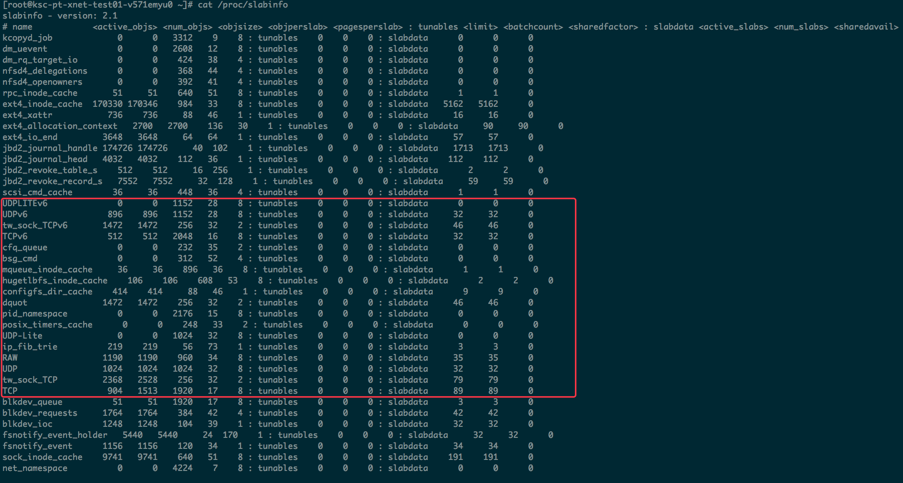
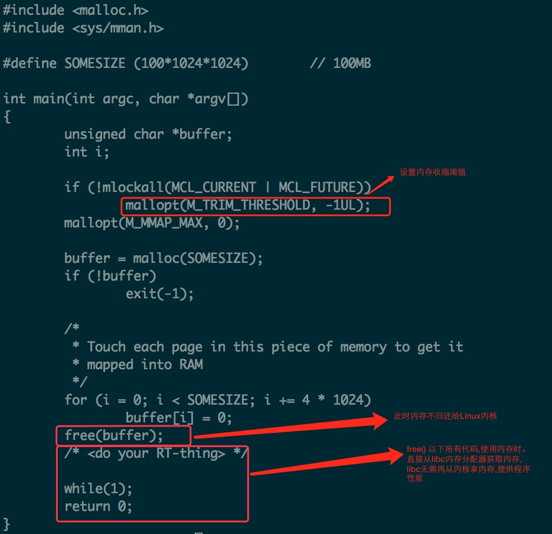

# Linux 内存管理

## 摘要
* slab、kmalloc/kfree、/proc/slabinfo和slabtop
* malloc/free、kmalloc/kfree与Buddy关系
* mallocopt
* vmalloc
* Linux lazy行为
* OOM(内存耗尽)、oom_score和oom_adj
* Android 进程生命周期与OOM

### Buddy算法问题
&emsp;&emsp;&emsp; 通过第一部分学习,咱们知道内存所有的ZONE都通过Buddy算法进行管理。在buddy算法中空闲物理内存会被分为11个组，其中第0,1，N个组分别对应2^0、2^n个连续物理界面。当需要申请的内存小于1页(4K),Buddy算法也会分配1页(4K)。此时再使用Buddy算法进行分配粒度太大了,对内存是一种极大的浪费。

* 

## Slab
&emsp;&emsp;&emsp; Buddy的最小单位是页(4k), 无论是内核还是用户程序都会申请一些更小的内存。所以在在Linux中对heap(堆)内存进行了二次管理,从Buddy拿到的内存(1K,4K,8K....)再次进行分割管理,这种就是Slab。

### slab原理
&emsp;&emsp;&emsp; 例如,申请8byte内存。Linux 内核首先会从Buddy申请到1页(4K)内存,然后将4K分成多个8byte,每一个8byte被称为Slab的一个object。
 
&emsp;&emsp;&emsp; Slab机制的实现算法有slab、slub、slob。每种算法的实现请参考[slab](imgs/slaballocators.pdf)。

&emsp;&emsp;&emsp; 备注: Slab英文"大块"的意思。就像在超市中买一大块牛肉,然后再进行切割,当牛肉被吃完后,还是需要去超市买一大块牛肉。Slab也是这样的原理,每次从Buddy申请一大块儿内存,然后分割成一个个object提供给内核或应用程序使用。

* 

### Linux slab使用
&emsp;&emsp;&emsp; Linux会针对一些小粒度内存的申请以及一些常规数据结构内存做slab,可以查看slab具体的分配情况(cat /proc/slabinfo):

* 

* 

 
&emsp;&emsp;&emsp; slab主要分为两类:

&emsp; &emsp; &emsp; 1. 第一类是内核里常用的数据结构,如TCPv6,UDPv6等。由于内核经常要申请和释放这类数据结构,所以就真对这些常用的数据结构分别做了slab,再次申请这类数据结构时就从所属的slab进行申请一个object(使用kmem_cache_alloc()函数申请)。
 
&emsp; &emsp; &emsp; 2. 第二类是一些小粒度的内存申请,如slabinfo中的kmalloc-16,kmalloc-32,kmalloc-64...(使用kmalloc申请)。

 
&emsp; &emsp; &emsp; 注意:不同数据类型申请内存时需要向当前所属数据类型的slab缓存进行申请,不能向其它数据类型slab缓存申请。而且slab只针对内核空间,跟用户空间没有关系。用户空间malloc/free 调用的libc库。

### Buddy 和Slab区别
&emsp; &emsp; &emsp; buddy将内存条当成一个池子进行管理(按页进行管理),slab从buddy拿到的内存当成一个池子进行管理。buddy和slab这两个都是内存分配器。slab管理的是来自Buddy的内存,而buddy管理的是Zone的内存。

### 用户态malloc/free、内核态kmalloc/kfree 与Buddy关系
&emsp; &emsp; &emsp; 所有的内存申请最终都来自于Buddy,但malloc/free和kmalloc/kfree都不是直接从Buddy申请和释放内存。而是从libc和slab二级分配器(由该二级分配器向Buddy申请和释放内存)申请和释放内存。
 
&emsp; &emsp; &emsp; slab和Buddy都是内存分配器,slab内存来自Buddy。slab和Buddy在算法级别上是对等的。
 
&emsp; &emsp; &emsp; malloc/free不是系统调用,它们是C语言libc库函数,与内核没有一一映射调用关系。malloc/free对内存操作真对的是libc(free()释放1M内存,并不会进行系统调用将内存还给buddy。malloc()也不会进行系统调用向buddy申请内存,可能会直接使用刚free掉的1M内存);同理,内核态kmalloc/kfree和Buddy不存在一一对应关系,而是从slab池操作。
 
*

### malloopt
&emsp; &emsp; &emsp; malloopt是libc库的函数,主要控制对二级内存分配器内存的控制。mallocopt可以控制libc把内存归还给内核的阈值。M_TRIM_THRESHOLD可以设置mmap收缩的阈值,默认值128K。当累计达到阈值时,free之后才将内存归还给内核M_TRIM_THRESHOLD的值必须设置为页大小对其,设置为-1会关闭内存收缩设置(libc库永远不会讲内存还给Linux内核)。

* 

&emsp; &emsp; &emsp; 如上程序调用mallopt函数,将M_TRIM_THRESHOLD设置为-1,表示内存用不收缩。虽然在接下来代码中free(buffer)掉100M内存,但是它也不会将libc内存归还给linux内核。则从/*\<do your RT-thing>\*/之后,再malloc和free都是在之前申请的100MB内存池进行操作,不会再和内存申请。这样可以使程序实时性提升,提高程序性能。这是一个在实时系统下的编程技巧。但在真实的项目中不建议这样使用,因为内存本身是紧缺资源,如果内存不尽兴收缩,其它进程内存使用有影响。

### Kmalloc Vs. vmalloc/ioremap

#### 内存空间
&emsp; &emsp; &emsp; 在对比kmalloc、vmalloc/ioremap之前,先来说说什么内存空间？内存空间并不是我们平时说的内存,平时我们所说的内存即内存条(主存)。内存空间不仅包括主存,它还包括寄存器、cpu缓存等。cpu在访问内存时都要经过: 虚拟地址-> MMU -> 物理地址 过程。

#### 页表理解
&emsp; &emsp; &emsp; 可以将页表理解成一个32位数组(IA32),其中高20位作为该数组的下标,低12位是偏移量。大家知道,虚拟通过高20位地址进行内存寻址。array[a]内存储就是物理地址(a就是高20位虚拟地址)。

#### Kmalloc、vmalloc/ioremap 内存申请

&emsp; &emsp; &emsp; 图中内存空间不同颜色的点都代表一页内存(buddy算法即是管理这些页的),无论是高端内存还是低端内存,都可以被kmalloc、vmalloc和用户空间的malloc申请。在一个也表中,几个不同的虚拟地址是可以对应一个相同的物理地址。
 
&emsp; &emsp; &emsp; 如上图所示,如果用户空间malloc申请了low memory zone白色圆圈内存,此时需要修改页表,标记用户空间2G虚拟地址映射到物理内存low memory zone 1页内存。当这一页4k物理内存被申请之后,kmalloc、vmalloc以及用户空间malloc都不能在申请这一页内存了。

#### kmalloc、vmalloc、malloc、ioremap 区别
&emsp; &emsp; &emsp;  malloc、vmalloc申请内存需要修改页表,kmalloc申请内存时无需修改页表(kmalloc开机时虚拟内存已经和low memory进行了映射)。如果low memory zone内存被用户空间已经申请,此时也需要修改内核空间页表。一旦low memory zone内存被用户申请,内核空间就不能访问该内存。虽然不能被内核空间访问,但已经被low memory zone映射区映射(此时,该物理页被映射到两个虚拟地址)。
 
&emsp; &emsp; &emsp; 寄存器是通过ioremap往vmalloc区域映射的。当调用ioremap时,需要更改页表,将vmalloc映射区虚拟地址和寄存器物理地址进行映射。

#### Vmalloc
Todo

#### 分配和映射区别
Todo

### 明天开搞...