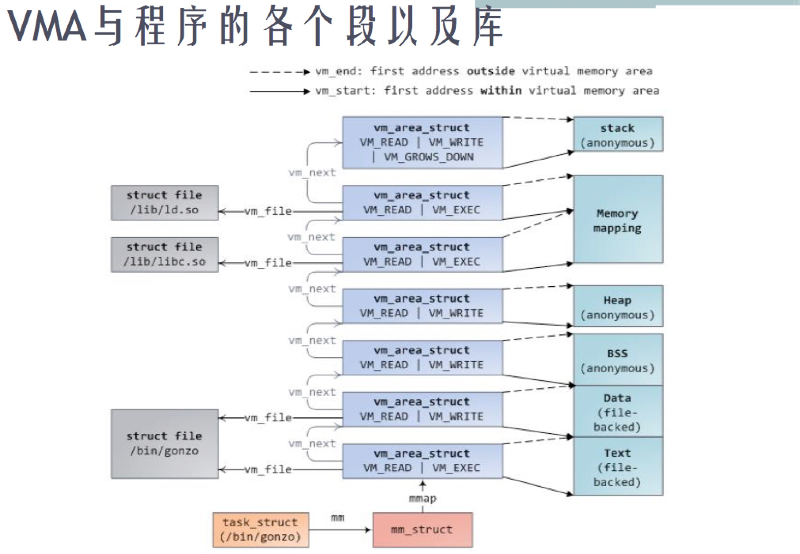
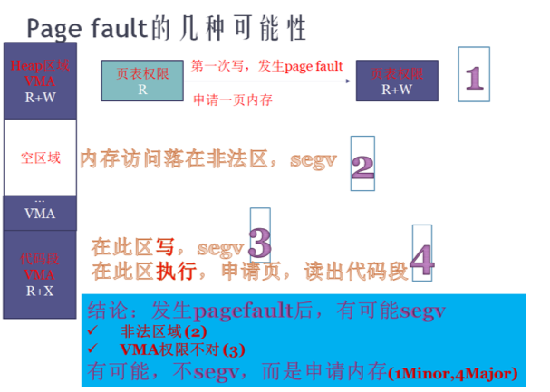

# Linux 内存管理

## 摘要
* 进程的VMA
* 进程内存消耗的四个概念: VSS、RSS、PSS和USS
* Page fault的几次可能性,major和minor
* 应用内存泄漏的界定方法
* 应用内存泄漏的检测方法: valarind和addresssanitizer

## 前言
&emsp;&emsp;&emsp; linux 应用程序耗费多少内存？是我们开发人员比较关心的一个问题。在linux系统中,使用一种lazy行为对内存进行管理。所以很多时候虽然申请了一段内存(malloc(100M)),但操作系统并没有为该应用程序分配真正物理内存。就通过学习笔记,学习一下Linux 中怎么对应用程序中内存如何管理。

## 进程内存管理
&emsp;&emsp;&emsp; 评估一个进程耗费多少内存,需要从多个角度考虑(虚拟内存、实际内存、共享内存、独享内存等)。统计一个进程消耗多少内存,一般不包括内核空间,仅说的是进程在用户态内存消耗情况(0~3G虚拟内存的映射,3G以上虚拟内存消耗是属于内核的,不算做用户进程的内存消耗)。

## 进程的虚拟地址空间VMA(Virtual Memory Area)

&emsp;&emsp;&emsp; 上图中,task_struct中的mm_struct就代表进程的整个内存资源,mm_struct中的pgd为页表,mmap指针指向的vm_area_struct链表的每一个节点就代表进程的一个虚拟地址空间,即一个VMA。一个VMA最终可能对应ELF可执行程序的数据段、代码段、堆、栈或者动态链接库的某个部分。

### pmap、/proc/pid/maps和/proc/pid/smaps
&emsp;&emsp;&emsp; 可以通过pmap、/proc/pid/maps或/proc/pid/smaps查看一个进程的虚拟地址空间。pmap 命令其实就是cat /proc/pid/maps实现。/proc/pid/smaps可以更加详细查看进程VMA的分布情况。

* 

 
&emsp;&emsp;&emsp; 观察pmap结果及maps,smaps文件。可以发现IA32下,一个进程VMA是在0~3G之间分散分布的,是一段一段的,中间会有很多空白区域,空白区域对进程来说都是不能访问的,VMA中会标注这一段的RWX的具体权限。当进程指针访问这些非法空白区域时,由于没有和物理内存进行映射,所以会出现"Page fault"异常,linux内核捕捉到该信号,发送信号,然后进程就会挂掉。如下图所示:

* 

 
&emsp;&emsp;&emsp; 另外VMA的具体内容可参考下图:

*

&emsp;&emsp;&emsp; 注意: 在VMA中区域并不一定分配内存。如调用malloc函数申请100M内存(malloc VMA会有100M内存(VSS))。通过pmap查看时,可以看到它的VSS大小为100M。它的权限是RW(可读可写)。

### linux VMA管理

1. 应用程序访问内存必须在VMA中。
2. 落在VMA(VMA限制地址是否合法)并不一定正确。例如应用程序在堆上申请100M内存,并没有真正拿到内存。而是被映射到0页。页表是只读的,页表是和硬件对应的(MMU只查页表)。
3. 当调用malloc 申请100M内存时,会多出一段VMA,大小为100M,权限为R+W。表页此时是只读权限。当发生写操作时,每一页被写的页都会发生"Page fault"。Linux 内核会进行硬件协同工作(malloc区域产生"page fault",硬件MMU通过寄存器读取到发生"page fault"地址所在位置和原因,确定在该VMA进行写入操作,然后查询VMA malloc区域权限(R+W)。程序有写入权限,linux会申请一页内存(虽然页表R权限,但VMA RW权限),然后将页表PTE权限修改为R+W。

### Page fault的几种可能性

&emsp;&emsp;&emsp; 在Linux系统中,有以下几种行为会发生Page fault,但其实被翻译成Page fault并不太准确。如上图所示,只有第一种情况,才是真正的缺页异常。因为Heap VMA区域有R+W权限,当通过该区域指针进行写入操作时,VMA有写入权限,但页表只有R权限。此时发生Page fault,然后分配内存,最后修改将页表修改为W+R权限。但2、3其实不是Page fault,而是非法操作,产生段错误,最终使程序退出。
 
&emsp;&emsp;&emsp; 接下来说一下触发Page fault的几种行为:
 
&emsp;&emsp;&emsp; 1.例如,调用malloc申请100M内存,IA32下在0~3G虚拟地址中立刻就会占用大小为100M的VMA,且符合heap的定义。这一段VMA的权限是R+W的。但由于Linux内存管理的Lazy机制,这100M其实并没有被分配,这100M全部映射到一个物理地址相同的零页,且在页表记录的权限为只读的。当100M中任何一页发生写操作时,MMU会给CPU发Page fault(MMU可以从寄存器读出发生Page fault的地址;MMU可以读出发生page fault的原因),linux内核收到缺页中断,在缺页中断的处理程序中读出虚拟地址和原因,去VMA中查,发现用户程序在写malloc的合法区域且有些权限,Linux内核就真正的分配内存,页表中对应一页的权限也修改为R+W。
 
&emsp;&emsp;&emsp; 2.例如,程序中有野指针访问了此程序运行时进程的VMA以外的非法区域,硬件就会收到page fault,进程会收到SIGSEGV信号段错误,进程被终止。
 
&emsp;&emsp;&emsp; 3.例如,代码段在VMA中权限为R+X,如果程序中有野指针访问到此区域去写,则也会发生段错误。(另,malloc heap在VMA中权限为R+W,如果程序的PC指针访问到此区域去执行,同样发生段错误)。
 
&emsp;&emsp;&emsp; 4.例如,执行代码段时发生缺页,Linux 申请1M内存,并从磁盘读取出代码段,此时发生I/O操作,为major主缺页(如果从磁盘ELF 文件代码段大小为16M大小,Linux并不会给你分配16M内存,而是采用Lazy机制,当读到当前页时发生Major page fault,才去读磁盘,然后将数据写入到内存页)。
 
|缺页||
|-|-|
|主缺页|次缺页|
|发生缺页必须读硬盘,如上图4)。有IO行为,处理时间长|发生缺页直接申请到内存,如:malloc内存,写时发生无IO行为,处理时间相对major短|
 
&emsp;&emsp;&emsp; 综述,page fault(Minor和Major行为是建立在合法区域的page fault)后,Linux会查VMA,也会对比VMA中和页表中的权限,体现出VMA的重要性。

