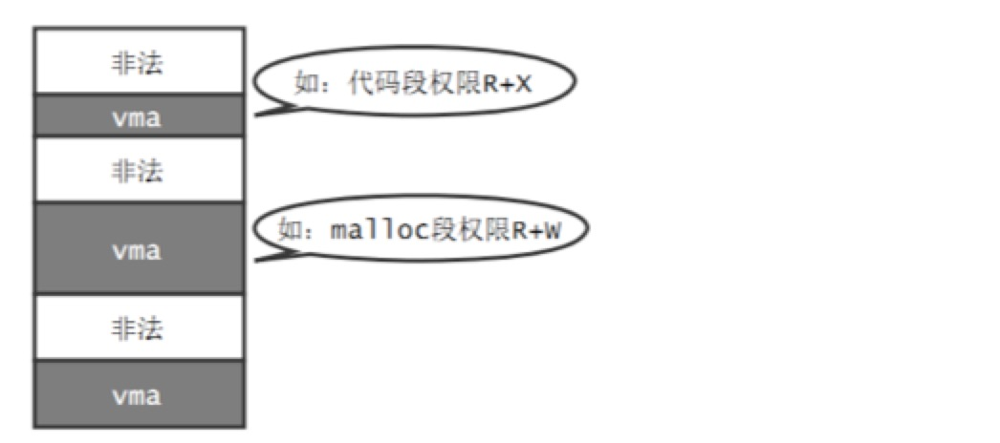

# Linux 内存管理

## 摘要
* 进程的VMA
* 进程内存消耗的四个概念: VSS、RSS、PSS和USS
* Page fault的几次可能性,major和minor
* 应用内存泄漏的界定方法
* 应用内存泄漏的检测方法: valarind和addresssanitizer

## 前言
&emsp;&emsp;&emsp; linux 应用程序耗费多少内存？是我们开发人员比较关心的一个问题。在linux系统中,使用一种lazy行为对内存进行管理。所以很多时候虽然申请了一段内存(malloc(100M)),但操作系统并没有为该应用程序分配真正物理内存。就通过学习笔记,学习一下Linux 中怎么对应用程序中内存如何管理。

## 进程内存管理
&emsp;&emsp;&emsp; 评估一个进程耗费多少内存,需要从多个角度考虑(虚拟内存、实际内存、共享内存、独享内存等)。统计一个进程消耗多少内存,一般不包括内核空间,仅说的是进程在用户态内存消耗情况(0~3G虚拟内存的映射,3G以上虚拟内存消耗是属于内核的,不算做用户进程的内存消耗)。

## 进程的虚拟地址空间VMA(Virtual Memory Area)

&emsp;&emsp;&emsp; 上图中,task_struct中的mm_struct就代表进程的整个内存资源,mm_struct中的pgd为页表,mmap指针指向的vm_area_struct链表的每一个节点就代表进程的一个虚拟地址空间,即一个VMA。一个VMA最终可能对应ELF可执行程序的数据段、代码段、堆、栈或者动态链接库的某个部分。

### pmap、/proc/pid/maps和/proc/pid/smaps
&emsp;&emsp;&emsp; 可以通过pmap、/proc/pid/maps或/proc/pid/smaps查看一个进程的虚拟地址空间。pmap 命令其实就是cat /proc/pid/maps实现。/proc/pid/smaps可以更加详细查看进程VMA的分布情况。

* 

 
&emsp;&emsp;&emsp; 观察pmap结果及maps,smaps文件。可以发现IA32下,一个进程VMA是在0~3G之间分散分布的,是一段一段的,中间会有很多空白区域,空白区域对进程来说都是不能访问的,VMA中会标注这一段的RWX的具体权限。当进程指针访问这些非法空白区域时,由于没有和物理内存进行映射,所以会出现"Page fault"异常,linux内核捕捉到该信号,发送信号,然后进程就会挂掉。如下图所示:

* 

 
&emsp;&emsp;&emsp; 另外VMA的具体内容可参考下图:

*

&emsp;&emsp;&emsp;  注意: 在VMA中区域并不一定分配内存。如调用malloc函数申请100M内存(malloc VMA会有100M内存(VSS))。通过pmap查看时,可以看到它的VSS大小为100M。它的权限是RW(可读可写)。

### linux VMA管理

1. 应用程序访问内存必须在VMA中。
2. 落在VMA并不一定正确。例如应用程序在堆上申请100M内存,并没有真正拿到内存。而是被映射到0页。页表是只读的,页表是和硬件对应的(MMU只查页表)。
3. 当调用malloc 申请100M内存时,会多出一段VMA,大小为100M,权限为R+W。表页此时是只读权限。当发生写操作时,每一页被写的页都会发生"Page fault"。Linux 内核会进行硬件协同工作(malloc区域产生"page fault",硬件MMU通过寄存器读取到发生"page fault"地址所在位置和原因,确定在该VMA进行写入操作,然后查询VMA malloc区域权限(R+W)。程序有写入权限,linux会申请一页内存(虽然页表R权限,但VMA RW权限),VMA限制地址是否合法。