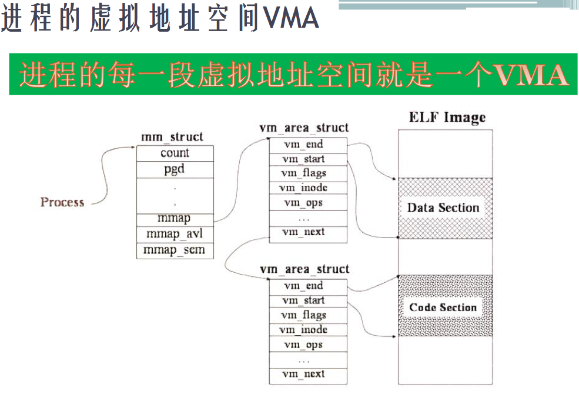

# Linux 内存管理

## 摘要
* 进程的VMA
* 进程内存消耗的四个概念: VSS、RSS、PSS和USS
* Page fault的几次可能性,major和minor
* 应用内存泄漏的界定方法
* 应用内存泄漏的检测方法: valarind和addresssanitizer

## 前言
&emsp;&emsp;&emsp; linux 应用程序耗费多少内存？是我们开发人员比较关心的一个问题。在linux系统中,使用一种lazy行为对内存进行管理。所以很多时候虽然申请了一段内存(malloc(100M)),但操作系统并没有为该应用程序分配真正物理内存。就通过学习笔记,学习一下Linux 中怎么对应用程序中内存如何管理。

## 进程内存管理
&emsp;&emsp;&emsp; 评估一个进程耗费多少内存,需要从多个角度考虑(虚拟内存、实际内存、共享内存、独享内存等)。统计一个进程消耗多少内存,一般不包括内核空间,仅说的是进程在用户态内存消耗情况(0~3G虚拟内存的映射,3G以上虚拟内存消耗是属于内核的,不算做用户进程的内存消耗)。

## 进程的虚拟地址空间VMA(Virtual Memory Area)

&emsp;&emsp;&emsp; 上图中,task_struct中的mm_struct就代表进程的整个内存资源,mm_struct中的pgd为页表,mmap指针指向的vm_area_struct链表的每一个节点就代表进程的一个虚拟地址空间,即一个VMA。一个VMA最终可能对应ELF可执行程序的数据段、代码段、堆、栈或者动态链接库的某个部分。

## 待续...

