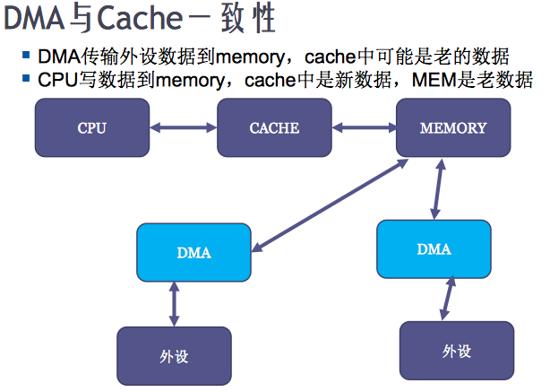

# 内存管理-其它工程问题以及调优

## 摘要
* DMA和Cache一致性
* 内存的Cgroup
* 性能方面的调优: page in/out,swapin/out
* Dirty ratio的一些设置
* swappiness

## DMA与Cache一致性
&emsp;&emsp;&emsp; 通过之前内存管理学习咱们知道,CPU需要访问内存首选需要通过MMU,然后进行数据操作。而DMA传输外设数据到内存,直接可以操作内存指定Zone,不需要通过MMU。
 
&emsp;&emsp;&emsp; 通过CPU从内存读数据时,首先检查Cpu cache中是否有缓存,如果有缓存,则直接从缓存中拿数据返回,不再请求内存(这样会提升性能);当CPU将数据写入到内存时,先写入到cpu Cache,然后再同步到主存(因为写到cache就返回了,所以性能会提升)。

### CPU写机制:Write-through与Write-back
* Write through

&emsp;&emsp;&emsp; CPU向cache写入数据时,同时向内存(后端存储)也写一份,使cache和memory的数据保持一致。优点是简单,缺点是每次都要访问memory,速度比较慢。
 

* Post write

&emsp;&emsp;&emsp; CPU更新cache数据时,把更新的数据写入到一个更新缓冲器,在合适的时候才对memory(后端存储)进行更新。这样可以提高cache访问速度。但是,在数据连续被更新两次以上的时候,缓冲区将不够实用，被迫同时更新memory(后端存储)。
 

* Write back

&emsp;&emsp;&emsp; CPU更新Cache时,只是把更新的Cache区标记一下,并不同步更新memory(后端存储)。只有在cache区要被新进入的数据替代时,才更新memory(后端存储)。这样做的原因是,考虑到很多时候cache存入的是中间结果,没有必要同步更新memory(后端存储)。优点是CPU执行的效率提高,缺点是实现起来比较复杂。

### CPU cache一致性问题

&emsp;&emsp;&emsp; 在上图1种,cpu去读内存,当从内存中读到内容之后会缓存在cpu Cache一份(图1,在cache 和memory中红色位置)。此时,如果图2中的DMA外设将一个白色内容搬移了内存原来红色的位置。这样当下一次再通过CPU读取原来内存中红色区域内容时,由于cpu cache中该数据已经存在,所以读取的内容还是上次缓存的数据。但是在内存中该区域的数据已经发生改变,所以此时就会存在缓存一致性问题。

### DMA Cache一致性解决方案

* Coherent DMA buffers(一致性DMA缓冲区)

* DMA Streaming Mapping